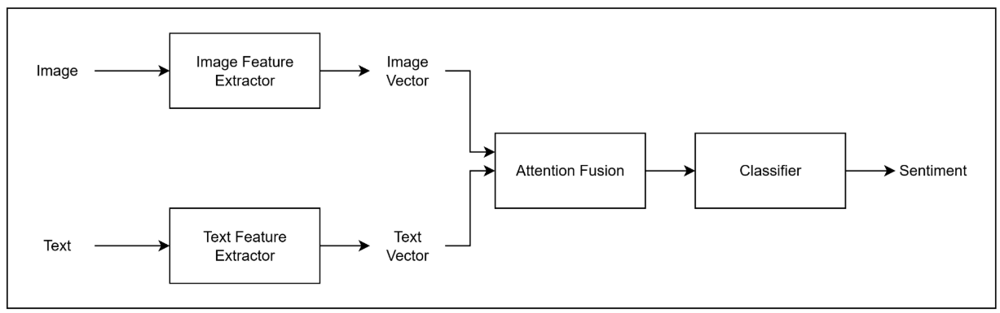

# Multimodal Sentiment Analysis
Multi-Modal Sentiment Analysis using Attention Based Fusion for Image and Text Data

A multi-modal model that can analyze an image + text (integrating two modality of data) to perform a deeper analysis. We do a sentiment classification (e.g. positive, negative, neutral, sarcastic) and generate a context-aware description.

## Demo Video

https://github.com/user-attachments/assets/37c145ca-5179-46dc-b715-b167a23ad07b

## Main Concept

### Cross-modal attention
- Modalities ‘query’ each other
- Text-guided visual attention: uses text features to decide which parts are important
- Visual-guided textual attention: use image features to decide which works in text are most relevant.
### Gated Fusion
- Dynamically decide how much to trust each other.

## How it works

- Train the visual model alone as an image-only sentiment classifier
- Train the textual model alone as a text-only sentiment classifier
- Export the feature extractor (backbone) of visual and textual model (discard the classifier head).
- Plug the visual & textual feature extractors into attention fusion and  train the multimodal model: A new classifier head will predict the final sentiment.

## Result

Platform: AWS g5.xlarge Machine

### Performance

| Model | Validation Accuracy |
|---|---|
| Text Only Unimodal (RoBERTa-LSTM) | 60% |
| Image Only Unimodal (RestNet50) | 54% |
| Attention Fusion model | 63.67% |

